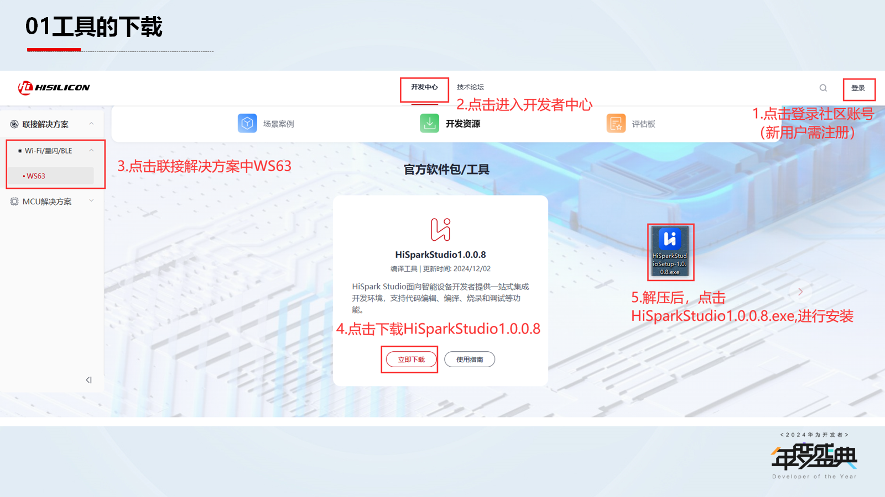
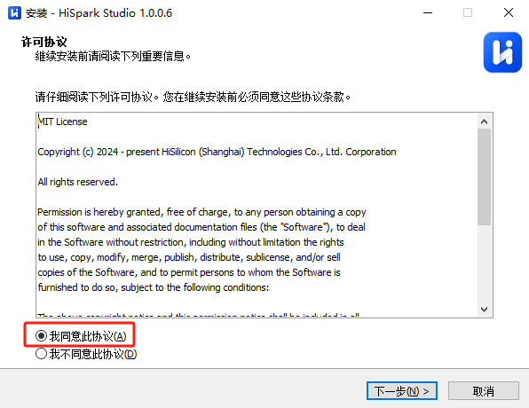
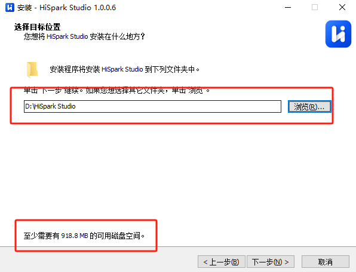
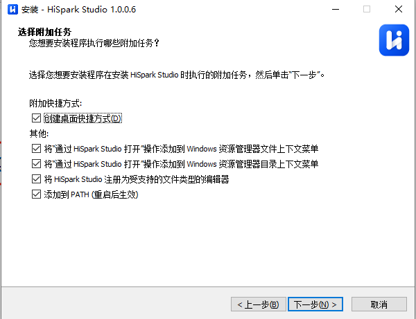
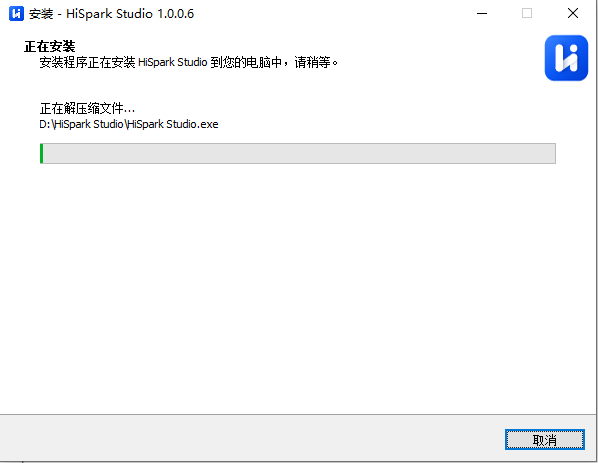
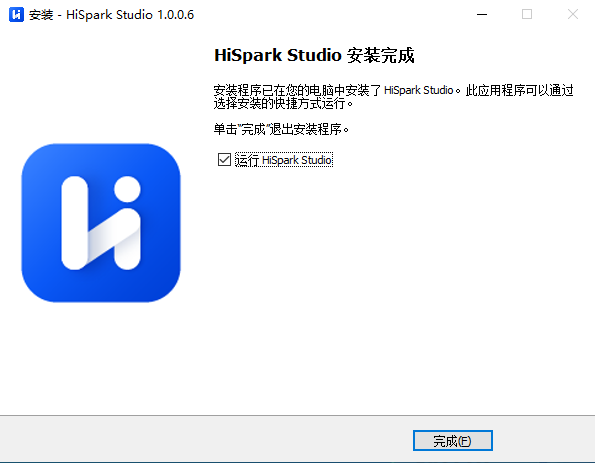
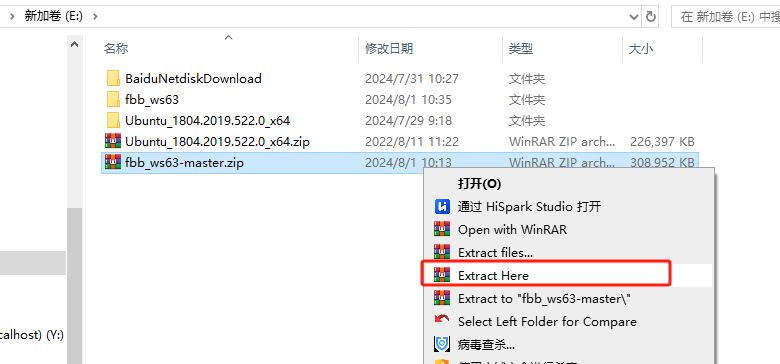
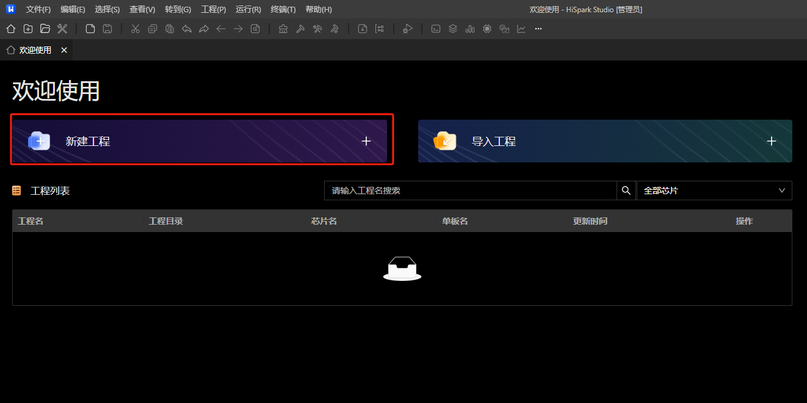
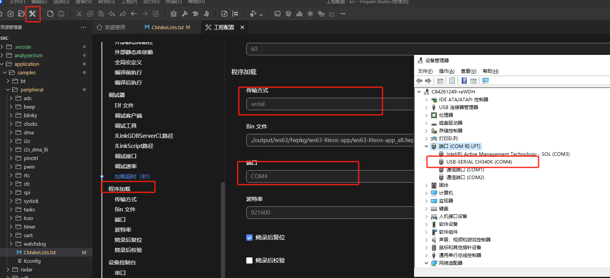
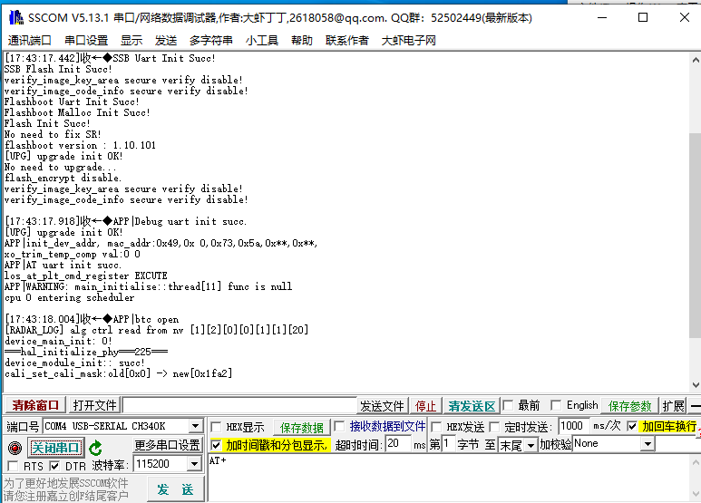

# Windows 环境搭建

**备注：仅Liteos 系统版本支持，Openharmony系统版本不支持windows环境搭建**

## HiSpark Studio安装

* 登录[上海海思开发者网站](https://developer.hisilicon.com/devCenter/index?id=9dfafc50-7189-4fb4-a)获取IDE工具，需要注册账号下载。

*  

* 下载完成后，双击"HiSparkStudio1.0.0.8.exe"安装。

   

* 安装界面如下，选择“我同意此协议”，点击“下一步”。

   
   
* 根据用户自身磁盘空间大小，选择对应的磁盘进行安装，选择完成后，点击下一步。

* 根据用户自身需要勾选附加任务，默认全部勾选，选择完成后，点击下一步。

* 点击“安装”，进行工具的安装。

* 安装过程如下，等待安装完成。

* 出现如下界面代表安装完成，点击完成即可。

* HiSpark studio打开主页界面如下。

## SDK代码下载

* 下载SDK代码，目前提供两种方式，第一种方式如下:

  * 第一种方式通过git指令下载（在Windows上使用git指令下载代码，需要提前安装git，这部分用户自行百度学习），在xx盘鼠标右键选择“Open Git Bash here”，如下图所所示

  

  * 在命令框中输入`git clone https://gitee.com/HiSpark/fbb_ws63.git`指令下载代码，等待下载完成。

  
  
  ​			

* 第二种方式ZIP下载方式如下：

  * [SDK包下载地址](https://gitee.com/HiSpark/fbb_ws63)，在主界面上点击“克隆/下载”，选择“下载ZIP”，等待下载，下载完成如下。

    

    

  *  解压“fbb_ws63_master”，解压方式选择“Extract Here”

  

  

## 新建工程

* 代码下载完成后，打开HiSpark studio工具，点击“新建工程”。

  

* 新建工程界面中芯片：“WS63”，工程名：“xxx”（用户自定义，但是不能带中文，特殊符号），软件包：“xxx/fbb_ws63/src”（SDK软件包存放路径，这个地方一定要选到src层级，否则新建会失败），配置选择完成后，点击“完成按钮”。

    

* 点击“build”或者“rebuild”编译

    

* 编译完成如下图所示。

    

## 镜像烧录

* 硬件搭建：Typec线将板端与PC端连接

* 安装驱动“ch340g驱动”（[CH340G驱动下载地址](https://www.wch.cn/downloads/CH341SER_EXE.html)，**如果该链接失效或者无法下载，用户自行百度下载即可**），安装ch340g驱动，安装前单板需要与PC端相连，点击安装即可。

  

  

* 安装成功后，在HiSpark Studio工具中点击“工程配置”按钮，选择“程序加载”，传输方式选择“serial”，端口选择“comxxx”，com口在设备管理器中查看。

  

* 配置完成后，点击工具“程序加载”按钮烧录。

  

* 出现“Connecting, please reset device...”字样时，复位开发板，等待烧录结束。

  

* 烧录完成后，复位开发板可以在串口中看到对应的打印信息（**串口工具自行选择即可**）。

  